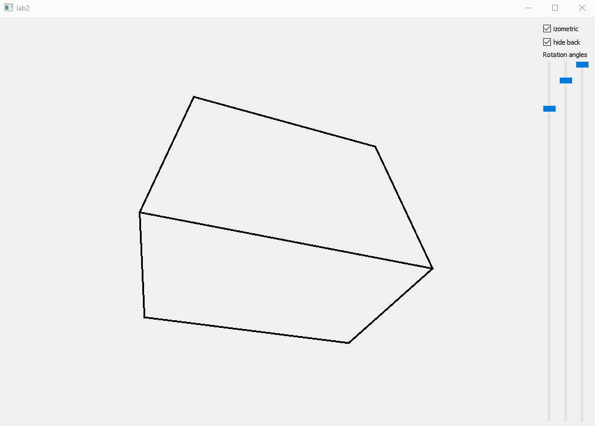

### Каркасная визуализация выпуклого многогранника, удаление невидимых линий

Приложение, которое позволяет визуализировать простые выпуклые 3D фигуры и применять к ним пространственные повороты вокруг трех измерений. Реализован простой движок с возможность представления любых выпуклых фигур, повороты фигур, а также некоторые изменения представления фигуры осуществляют при помощи матриц преобразования.

Для работы данного приложения требуется установить QT Creator, либо подключить нужные библиотеки.


### GIF



### Описание файлов

_abstractpaintitng3d.h/.cpp_ -абстракция для фигур, содержит метод calculatePolygons() который вызывается при отрисовке фигуры

_abstractpolygon3d.h/.cpp_ -  абстракция для полигонов, нужна, если нужно создать кастомный полигон

_cuboidclass.h/.cpp_ – куб, рисует куб.

_polygon3d.h/.cpp_ – полигон по трем точкам	

_rectpolygon3d.h/.cpp_ – полигон по четырем точкам

_scenemodifier.h/.cpp_ – сцена на которой происходят применение преобразований к фигурам, отвечает за отрисовку фигур

_transformer.h/.cpp_ – отвечает за преобразования, вычисляет итоговую матрицу преобразования

_transform.h /.cpp_ – содержит множество статических элементов, которые вычисляют матрицы преобразований (повороты, масштабирование)

_widget3d.h/.cpp_ – виджет, на который происходит отрисовка.

### Как создать свою фигуру

#### 1. Создать класс и наследоваться от AbstractPainting3D

```c++
class CuboidClass : public AbstractPaintitng3D
```

#### 2. Перегрузить метод calculatePolygons()

_CuboidClass.h_
```c++
...
void calculatePolygons() override;
...
```
_CuboidClass.cpp_
```c++
...
void CuboidClass::calculatePolygons() {
        addPolygon(new RectPolygon3D(points[0], points[1], points[2], points[3]));
        addPolygon(new RectPolygon3D(points[2], points[6], points[7], points[3]));
        addPolygon(new RectPolygon3D(points[7], points[6], points[5], points[4]));
        addPolygon(new RectPolygon3D(points[0], points[4], points[5], points[1]));
        addPolygon(new RectPolygon3D(points[1], points[5], points[6], points[2]));
        addPolygon(new RectPolygon3D(points[0], points[3], points[7], points[4]))
}
...
```

#### 3. Добавить фигуру в SceneModifier

```c++
...
scene.addFigure(new CuboidClass(80, 120, 100));
...
```
